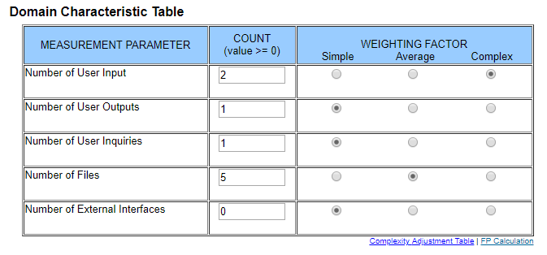
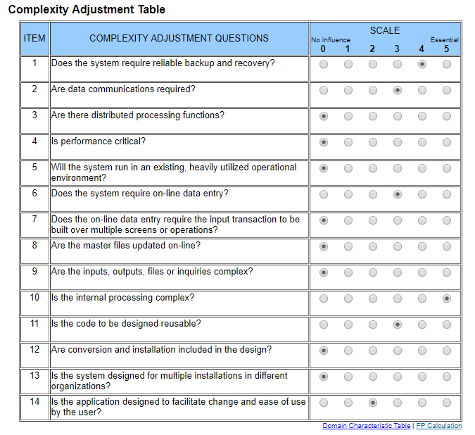

# Use-Case Specification: Close Account

## 1. General

A short overview of the use case including first mock-ups.

### 1.1 Brief Description

A user is able to close his account and delete his information from out database if he wishes to do so.

### 1.2 Mock-up

Closing the account is part of the "Edit Profile" Page which is implemented in another use case.

## 2. Flow of Events

A flowchart about what happens on each side of the application for this specific use case.

### 2.1 Basic Flow

## 3. Special Requirements

N/A

## 4. Preconditions

A short overview of what is required to conduct this use case.

### 4.1 Logged in

The user needs to be logged in to close his account.

## 5. Postconditions

Description of what is required after the user submitted the form or requested to delete the account.

### 5.1 Delete data from database

Check which information the user wants to update and if they are valid - e.g. check if the
E-Mail doesn't already exist in the database.

### 5.2 Redirect to welcome page

As soon the user data is deleted, he will be redirect to welcome page and not be able to log in
with the same credentials.

## 6. Extension Points

N/A

## 7. Function Points

Function points for this use case are: 58.65 (calculated by ([http://groups.umd.umich.edu/cis/course.des/cis525/js/f00/harvey/FP_Calc.html?tCountVal=0#FPCalc](http://groups.umd.umich.edu/cis/course.des/cis525/js/f00/harvey/FP_Calc.html?tCountVal=0#FPCalc))

