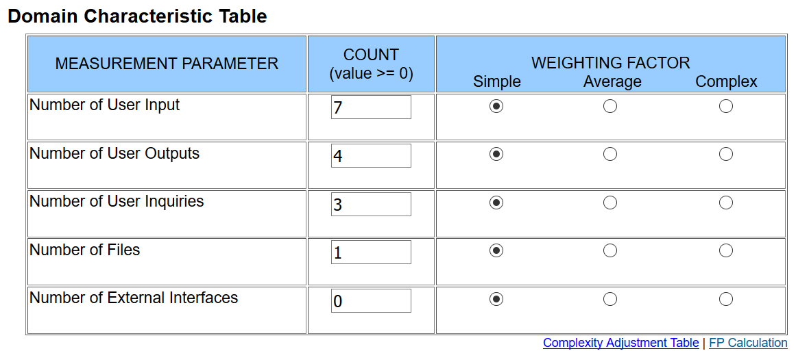
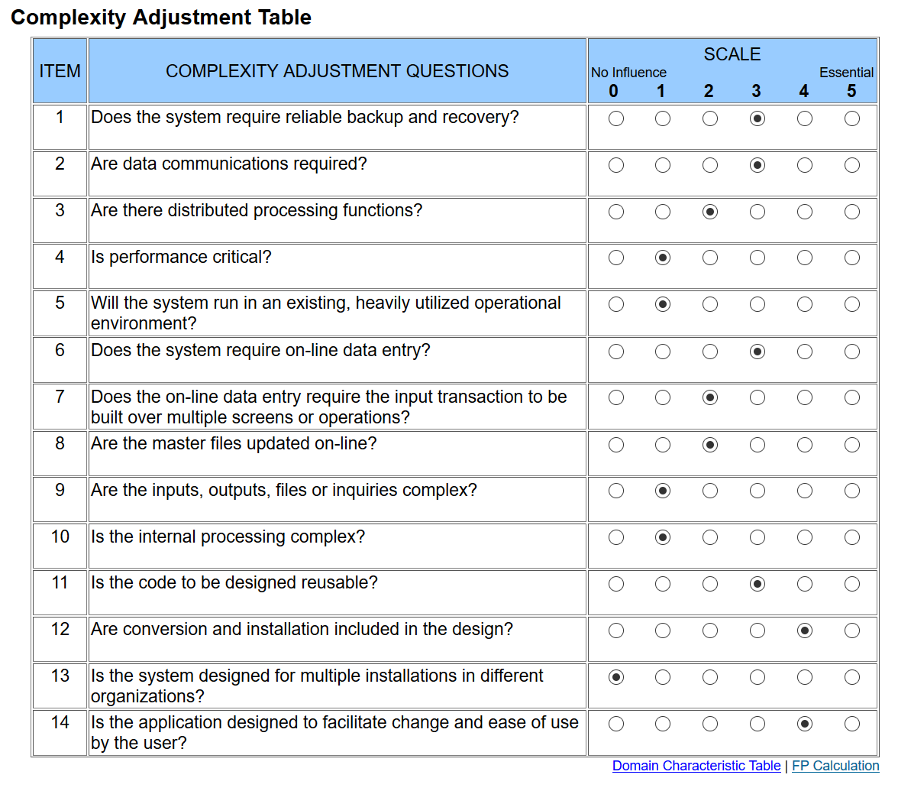

# Use-Case Specification: Edit Profile

## 1. General

A short overview of the use case including first mock-ups.

### 1.1 Brief Description

A user can update his profile to either change is password, E-Mail or add additional information that are not necessarily needed, but can be displayed elsewhere.

### 1.2 Mock-up

## 2. Flow of Events

A flowchart about what happens on each side of the application for this specific use case.

### 2.1 Basic Flow

## 3. Special Requirements

N/A

## 4. Preconditions

A short overview of what is required to conduct this use case.

### 4.1 Log in

The user needs to be logged in to edit his account.

## 5. Postconditions

Description of what is required after the user submitted the form.

### 5.1 Validate updated fields

Check which information the user wants to update and if they are valid - e.g. check if the
E-Mail doesn't already exist in the database.

### 5.2 Store data

Store the updated information in the database.

## 6. Extension Points

N/A

## 7. Function Points

Function points for this use case are: 50.35 (calculated by ([http://groups.umd.umich.edu/cis/course.des/cis525/js/f00/harvey/FP_Calc.html?tCountVal=0#FPCalc](http://groups.umd.umich.edu/cis/course.des/cis525/js/f00/harvey/FP_Calc.html?tCountVal=0#FPCalc))

