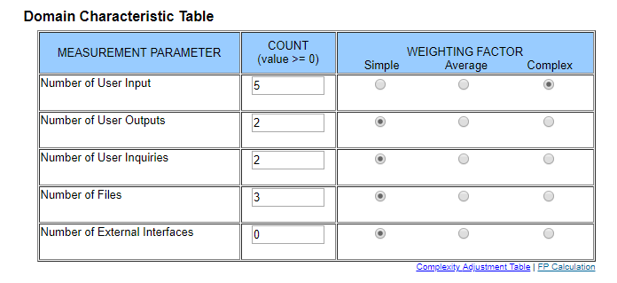
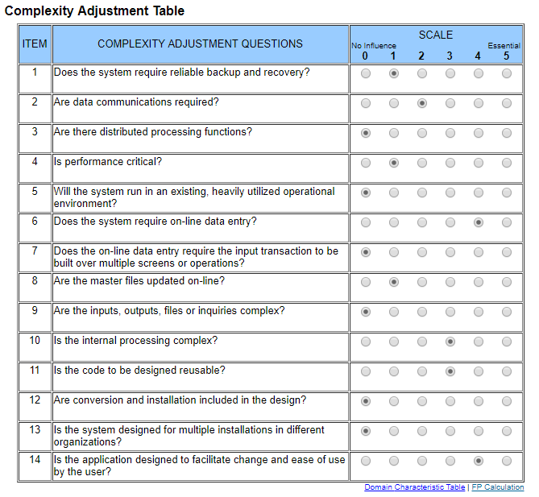

# Use-Case Specification: Learning

## 1. General

A short overview of the use case including first mock-ups.

### 1.1 Brief Description

A user can start a new learning session. He can select which flashcardbox he wants to use, decide if his answer to the flashcard was correct and can see his statistics while learning.

### 1.2 Mock-up

## 2. Flow of Events

A flowchart about what happens on each side of the application for this specific use case.

### 2.1 Basic Flow

## 3. Special Requirements

N/A

## 4. Preconditions

A short overview of what is required to conduct this use case.

### 4.1 Log in

The user needs to be logged in to start a new learning session.

### 4.2 Existing Flashcards

The user needs to have at least one flashcardbox with flashcards in it to learn with the selected box.

## 5. Postconditions

Description of what is required after the user submitted the form.

### 5.1 Storing statistics

The statistics of the learning session need to be stored in the database.
This way the frequency of learning certain flashcards can be adjusted accordingly to the progress.

## 6. Extension Points

N/A

## 7. Function Points

Function points for this use case are: 54.6 (calculated by ([http://groups.umd.umich.edu/cis/course.des/cis525/js/f00/harvey/FP_Calc.html?tCountVal=0#FPCalc](http://groups.umd.umich.edu/cis/course.des/cis525/js/f00/harvey/FP_Calc.html?tCountVal=0#FPCalc))

