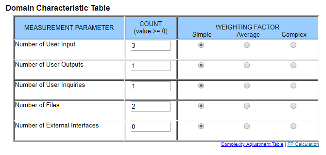
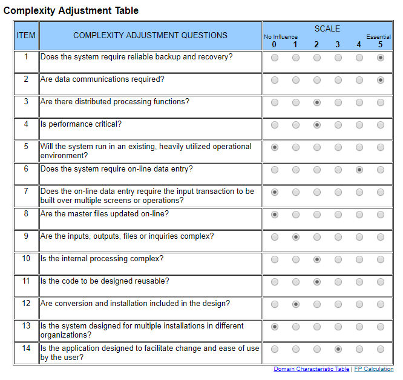

# Use-Case Specification: Login

## 1. General

A short overview of the use case including first mock-ups.

### 1.1 Brief Description

A visitor will be able to log in to his account by providing his username and password.
To log in is needed to use the full functionality of our platform.
According feature file:

  - [loginBackendFeedback.feature](https://github.com/phoenixfeder/fc-com/blob/master/frontend/features/loginBackendFeedback.feature)

### 1.2 Mock-up

## 2. Flow of Events

A flowchart about what happens on each side of the application for this specific use case.

### 2.1 Basic Flow

## 3. Special Requirements

N/A

## 4. Preconditions

Description of what is required before the user submitted the form.

### 4.1 Not logged in yet

The user should not be able to log in when he already is.

## 5. Postconditions

Description of what is required after the user submitted the form.

### 5.1 Authorization

The provided username and password needs to be checked for presence and correctnes in the backend.

### 5.2 Store token

On success, the client side needs to store a token to remember that the user is now logged in.

## 6. Extension Points

Function points for this use case are: 27.6 (calculated by ([http://groups.umd.umich.edu/cis/course.des/cis525/js/f00/harvey/FP_Calc.html?tCountVal=0#FPCalc](http://groups.umd.umich.edu/cis/course.des/cis525/js/f00/harvey/FP_Calc.html?tCountVal=0#FPCalc))

