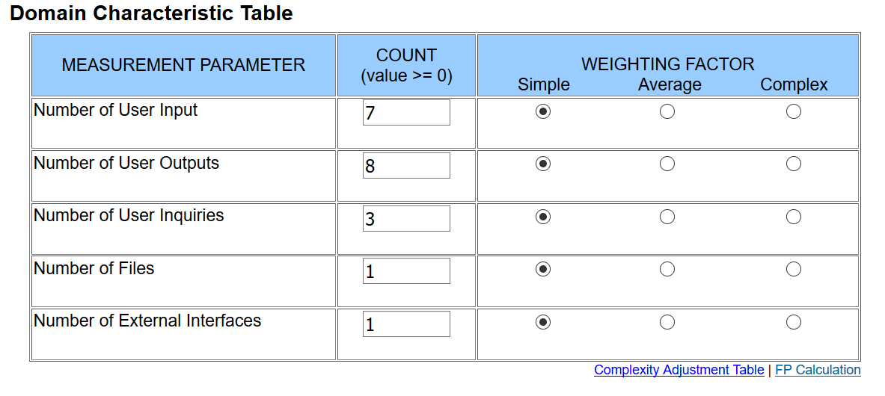
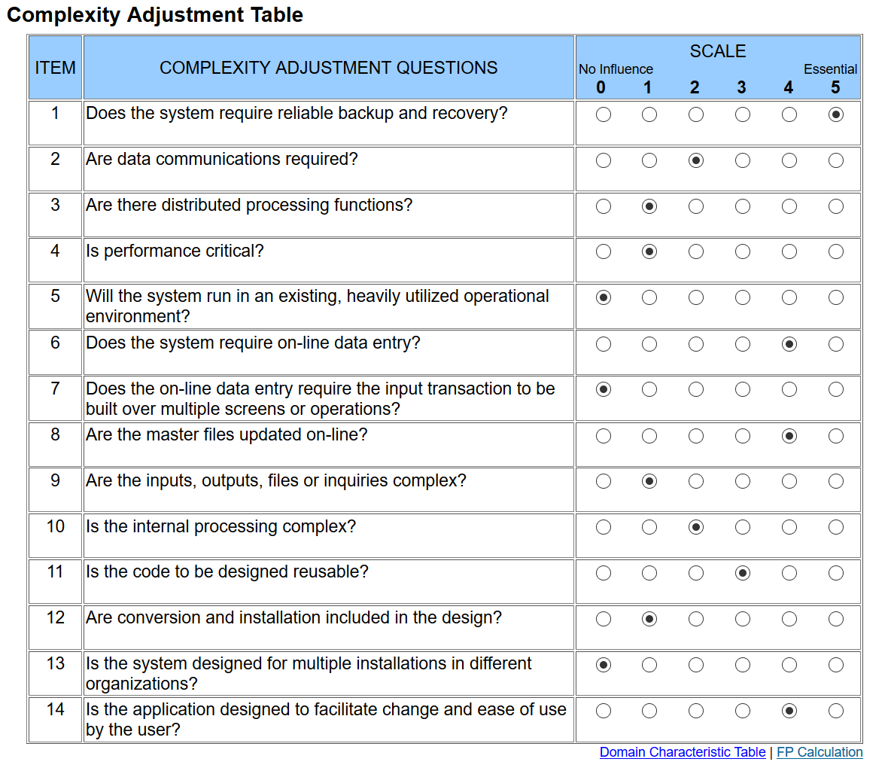

# Use-Case Specification: Register

## 1. General

A short overview of the use case including first mock-ups.

### 1.1 Brief Description

A visitor will be able to register on our site by providing a username, a password and an
E-mail address. It is needed to use our platform.
According feature file:

- [registerValidation.feature](https://github.com/phoenixfeder/fc-com/blob/master/frontend/features/registerValidation.feature)
- [verficationValidation.feature](https://github.com/phoenixfeder/fc-com/blob/master/frontend/features/verificationValidation.feature)

### 1.2 Mock-up

## 2. Flow of Events

A flowchart about what happens on each side of the application for this specific use case.

### 2.1 Basic Flow

## 3. Special Requirements

N/A

## 4. Preconditions

N/A

## 5. Postconditions

Description of what is required after the user submitted the form.

### 5.1 Data validation

Data given by the visitor must be validated and checked if the given username and E-Mail aren't taken yet.

### 5.1 Store data

If the data was validated and are in the right format, they need to be stores in the database.

## 6. Extension Points

N/A

## 7. Function Points

Function points for this use case are: 68.82 (calculated by ([http://groups.umd.umich.edu/cis/course.des/cis525/js/f00/harvey/FP_Calc.html?tCountVal=0#FPCalc](http://groups.umd.umich.edu/cis/course.des/cis525/js/f00/harvey/FP_Calc.html?tCountVal=0#FPCalc))

